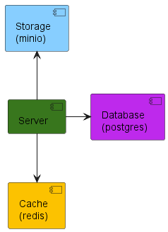
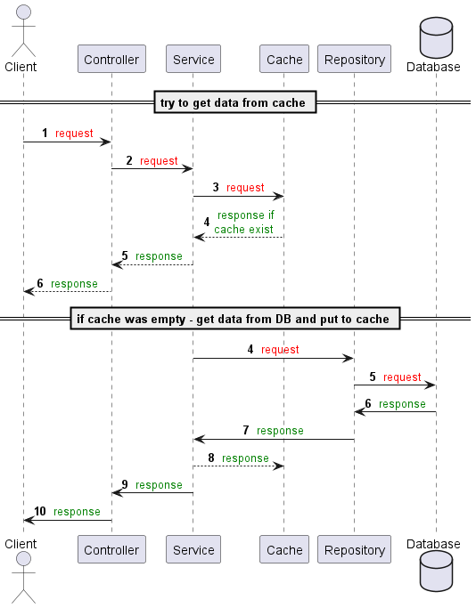
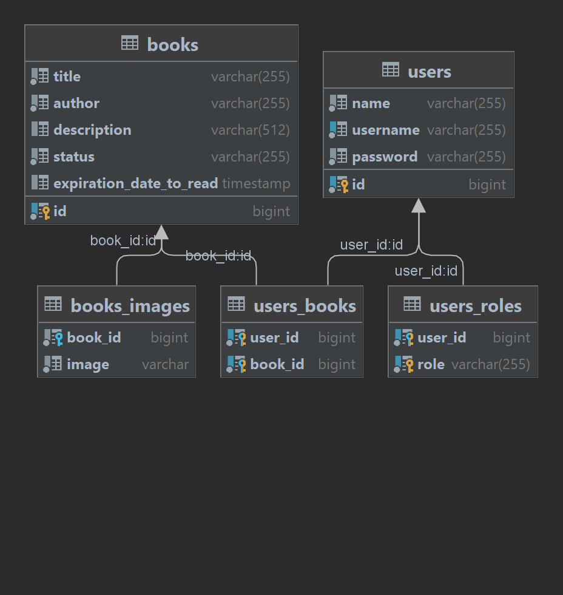

# book-list-tracker (планировщик для чтения книг)

## Описание проекта:
Данный проект представляет из себя api, позволяющий:
- регистрировать юзеров
- добавлять им книги
- обновлять статус чтения книг (планируется / читает сейчас / прочитано)
- планировать дату, до которой нужно прочитать книгу
- обновлять информацию о юзерах и книгах
- удалять юзеров и книги

## Component diagram:

## Sequence diagram:

## Class diagram:

## Библиотеки:
Spring starters: jdbc, jpa, security
Lombok
Postgresql
Mapstruct
Jakarta validation
Jjwt
Mybatis

## Структура проекта:

## Сборка проекта:

## Задачи: